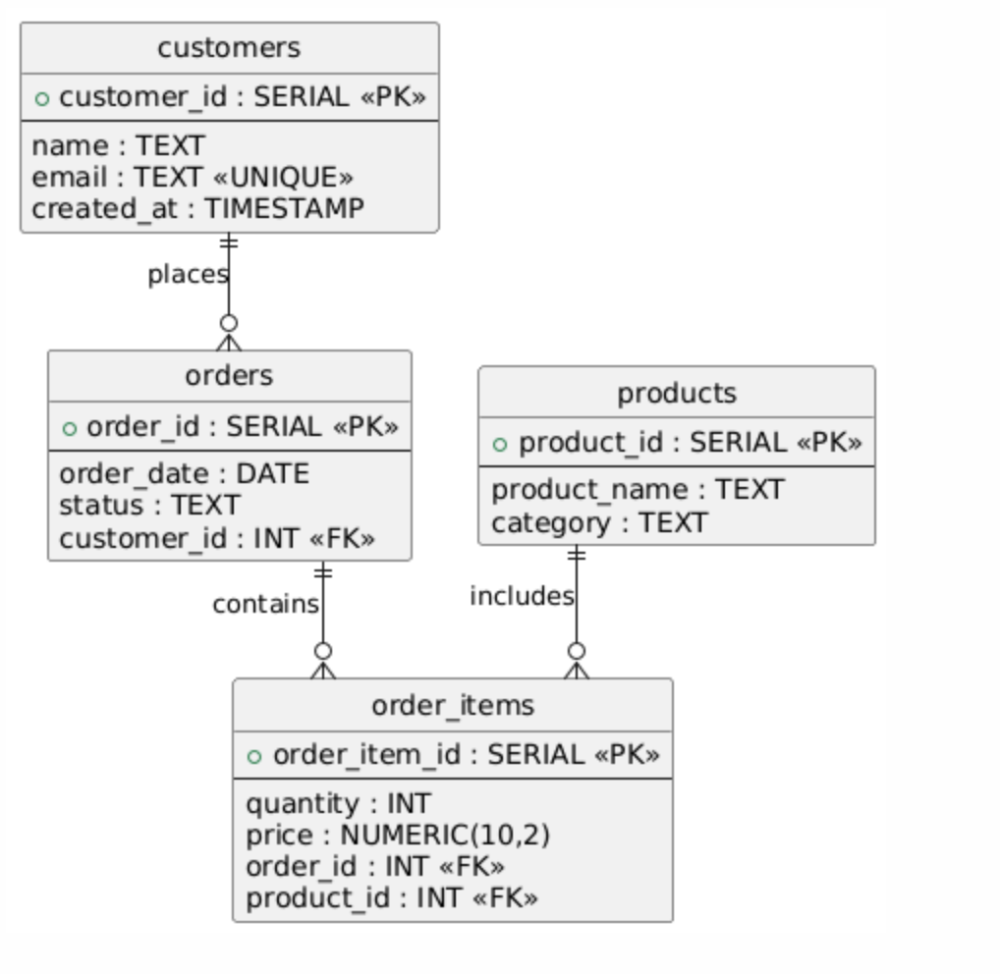
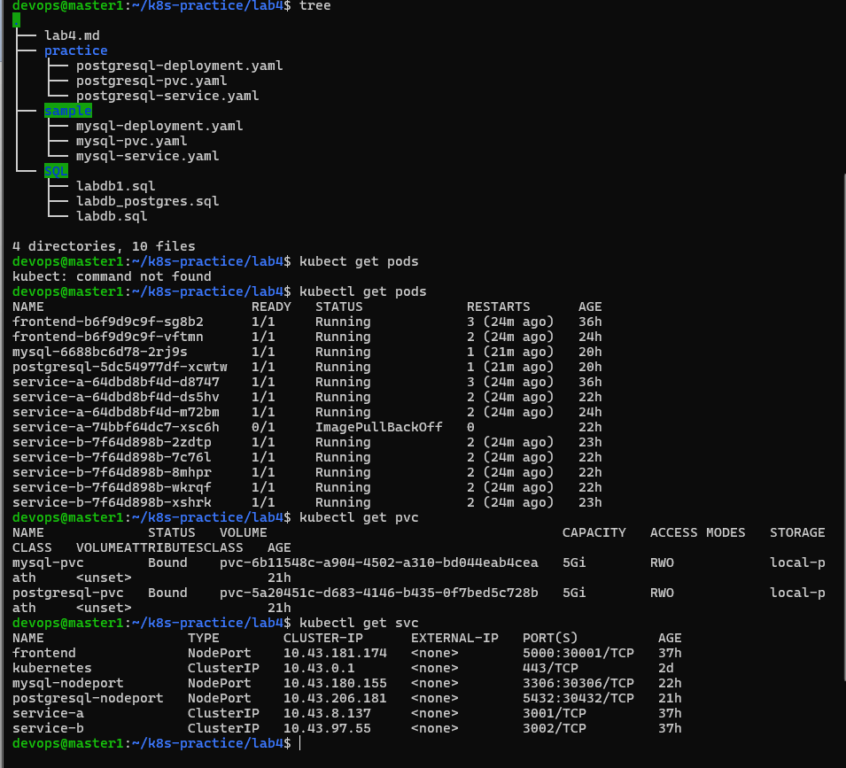
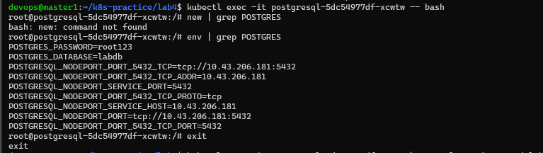
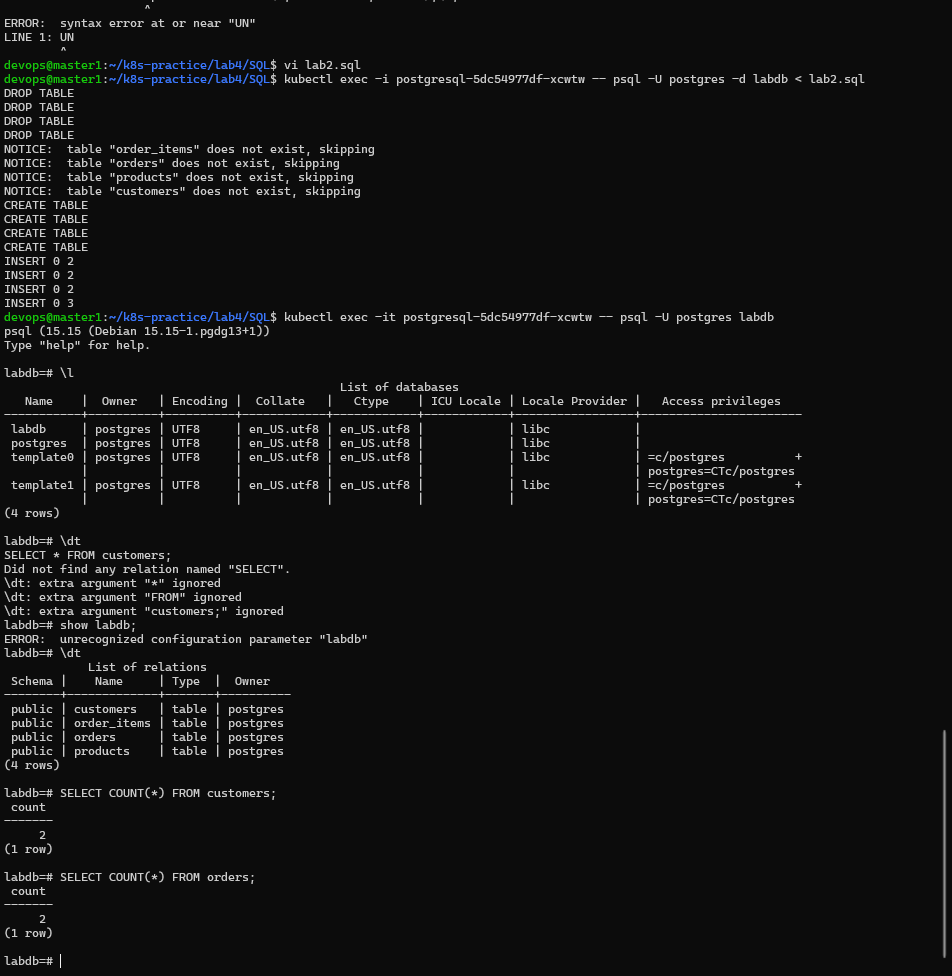
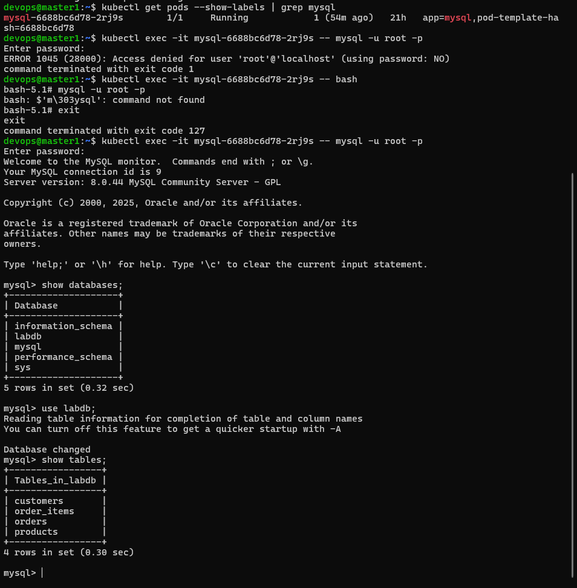

# PVC and PV and SQL

## PersistentVolume (PV)

**PersistentVolume (PV)** is a piece of storage in a Kubernetes cluster that has been provisioned by an administrator or dynamically by Kubernetes.

It represents the actual physical storage resource, such as a disk, NFS share, or cloud storage.

## PersistentVolumeClaim (PVC)

**PersistentVolumeClaim (PVC)** is a request for storage made by a user or application.

It specifies how much storage is needed and how it should be accessed, but not the actual storage implementation.

## Practice

Based on the sample folder, create a PostgreSQL database and use SQL to practice writing and executing queries.

### Step 1: Deploy a PostgreSQL database in Kubernetes (K8s)

### Step 2: Apply the SQL scripts in the Data folder to create the database schema. If the syntax is not compatible with PostgreSQL, please modify it accordingly.



### Step 3: Write your own SQL queries to practice and explore the data.

- 3.1. Total spending of each customer.
- 3.2. Customer with the highest-value order.
- 3.3. Revenue by product category.
- 3.4. Top 3 highest-spending customers.
- 3.5. Best-selling product in each category.

# Reference

1. kubernetes.io, "Persistent Volumes", [Open the Link](https://kubernetes.io/docs/concepts/storage/persistent-volumes/).


### Kết quả

1. Kiểm tra PVC, Pods, Service:
```bash
kubectl get pods

kubectl get pvc

kubectl get svc

```



2. Truy cập PostgreSQL

`kubectl exec -it postgresql-5dc54977df-xcwtw -- bash`



3. Tạo db, import file

```bash
kubectl exec -it postgresql-5dc54977df-xcwtw -- createdb -U postgres labdb

kubectl exec -i postgresql-5dc54977df-xcwtw -- psql -d  labdb <SQL/labdb2.sql

```

4. Check
`kubectl exec -it postgresql-5dc54977df-xcwtw -- psql -U postgres -d labdb`




Bonus: MySql 
