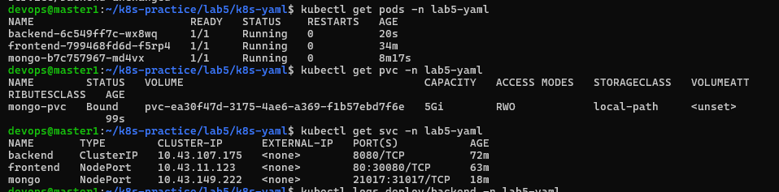

```bash
kubectl create secret docker-registry nexus-secret --docker-server=192.168.126.99:8082 --d
ocker-username=admin --docker-password=08072004 -n lab5 --dry-run
=client -o yaml > secret-nexus.yaml
```

Check hệ thống


Giao diện frontend:

